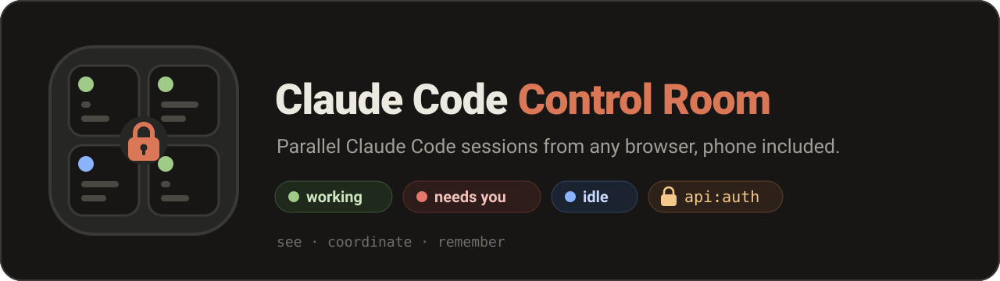
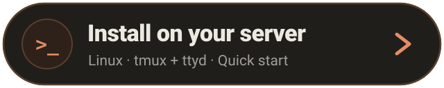
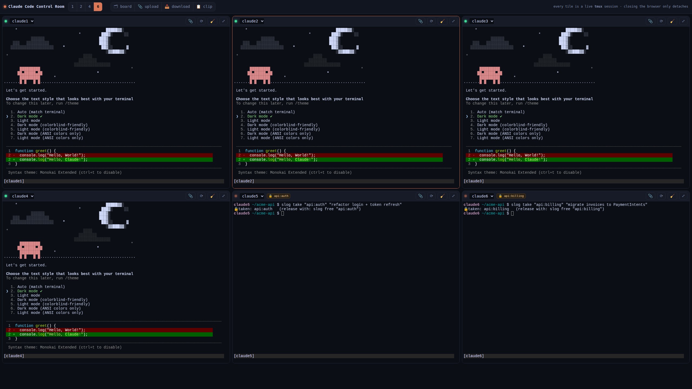
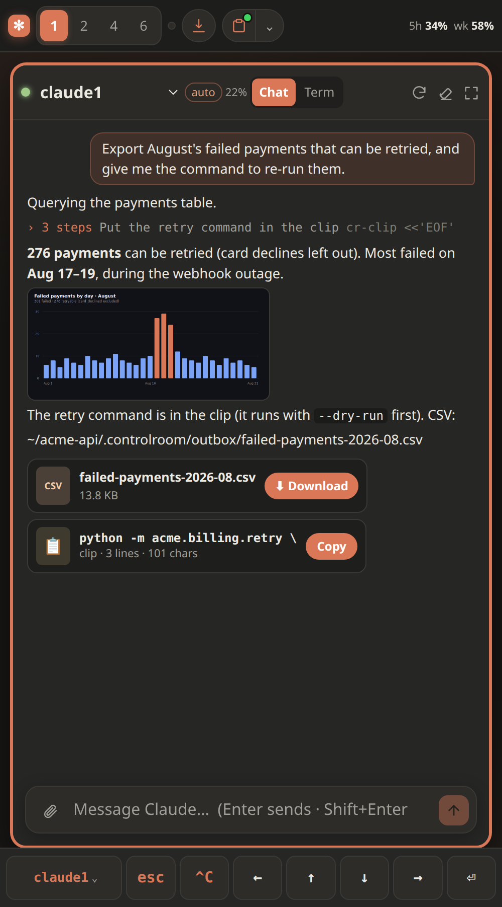
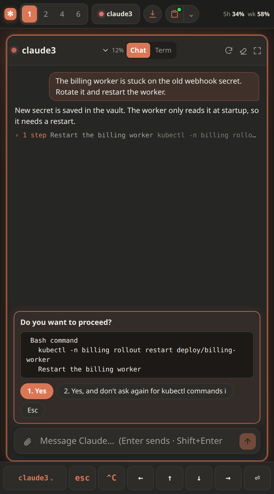
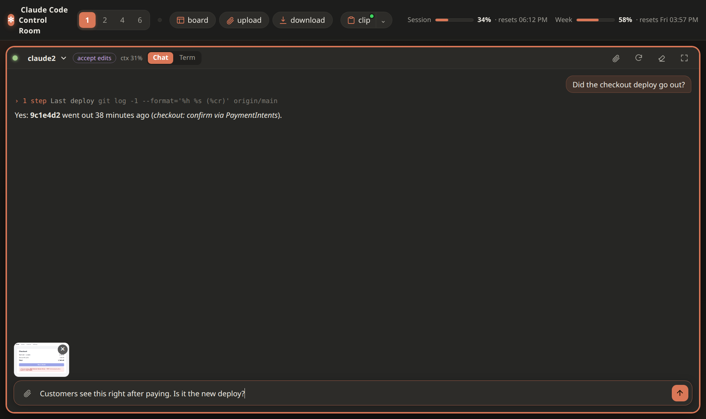

<p align="center"></p>

[](https://github.com/Ramillax/claude-code-control-room/actions/workflows/ci.yml)
[](LICENSE)

**Run several Claude Code sessions in parallel from any browser, phone included, and see at a glance which one is working, which one is waiting for your permission, and who is touching what.**

<p align="center">
  <a href="https://codespaces.new/Ramillax/claude-code-control-room?quickstart=1"></a>&nbsp;&nbsp;<a href="#quick-start"></a>
</p>
<p align="center"><sub>The Codespace's port is private: only your GitHub account can open it. Log in to Claude Code in the first tile and you're running.</sub></p>



<sub>Staged demo: synthetic conversations for a made-up <code>acme-api</code> project and real <code>slog</code> commands; the state events were fired by hand.</sub>

**The idea: give Claude Code its own machine.** Run it on a VPS or a sandbox box, not on your laptop, let it work with broad permissions there, and drive it from anywhere: your desk, your phone, a train. The worst a session can break is that box, which is what makes long unattended runs and auto mode reasonable. The control room is how you watch and steer it.

Three layers, one idea: **several agents working on the same project without stepping on each other**.

| Layer | Answers | Lives in |
|---|---|---|
| **See** | what is each session doing right now, which one needs me? | the web grid + Claude Code hooks |
| **Coordinate** | who is touching what, right now? who changed what, and from which session? | `slog`: a live board with locks (ephemeral) · `cr-hist`: per-session file history |
| **Remember** | what did we learn, and why did we decide it? | skills in 3 layers + `skill-sync` (durable) |

What you get:

- **A chat view on every tile, with the terminal still underneath.** Each session reads like a chat app: markdown, tables, code with a Copy button, and every tool call folded into one line per group with the **real command as a grey hint**, so it stays as dense as a terminal. When Claude asks for permission, a card shows **exactly what it wants to run** (the full command, or the diff for an edit) with one button per option. A message box with paste/drop for images and PDFs (previewed before sending), Claude's animated working line, "send now" to interrupt with a queued message, and a clear card when a tile has no Claude running. One tap on **Term** and the real terminal is there, never restarted. See [The Chat view](#the-chat-view).
- **Live state per session**: working, idle, or **waiting for your permission**. It comes from Claude Code's own hook events, not from screen-scraping, so it doesn't break when the CLI's UI changes. A red badge in the top bar takes you straight to the session that needs you, and it clears whether you answer yes, no or Esc (no hook fires on a "no", so the server confirms it on screen; see [below](#the-permission-badge-and-the-no-case)).
- **`slog`, a shared board with hierarchical locks.** Every session can see what the others are doing and claim a resource (`api`) or just part of it (`api:auth`). Each tile shows the locks its session holds. Locks are advisory by default; tie one to files with `--paths` and a hook **enforces** it: other sessions get their edits to those files denied.
- **Every session starts informed**: a SessionStart hook injects the live locks, the recent feed, the files other sessions just changed, the project's notes (done / next / don't redo) and how to hand you files and clips in the Chat view into each new session, also after `/clear` and compaction. Nobody has to remember to run `slog status`.
- **History by session**: every file a session writes is committed on its own, labeled with the session and its transcript id, in a shadow git repo that never touches your project's `.git`. `cr-hist changed` answers "what did the other sessions change?", `cr-hist who <file>` leads to the conversation that made a change.
- **Mode and plan usage at a glance**: each tile shows Claude Code's permission mode (auto / accept edits / plan / manual; **tap it to switch**, like Shift+Tab) and how much context the conversation uses. The top bar shows your plan's **5-hour session and weekly usage** with their reset times, read from a silent status line.
- **Built for the phone**: the Chat view is plain web text, so you select and scroll with your finger; in Term, an on-screen key bar (Esc, arrows, Tab, Ctrl-C), swipe to scroll history, tap-to-jump between sessions. The header fits one row.
- **Files both ways**: paste a screenshot with **Ctrl-V**, drop files, or use 📎; images and PDFs show as thumbnails in the chat and open large in an **in-page viewer**, including the ones Claude reads or links with ``. When Claude hands you a file, it shows up **in the chat as a Download card** (name, size, one tap), as long as the path it wrote exists inside `CR_FILE_ROOTS`; the download dialog still opens on the outbox where agents drop things for you.
- **📋 One-tap clip**: ask the agent to put something in the clip (a command, a URL, a draft) and it writes it with `cr-clip`; you copy it with one tap, from the top bar or from the **Copy card** that appears in the chat right where the agent loaded it, next to any file it handed you. The clip is one for every session, so the **⌄** next to 📋 keeps the last four: if another session overwrote yours, it's one tap away. In Chat you can also just select text with your finger; the clip is for exact text you'd rather not select by hand (a long command, a token), and it's still the way to copy from Term on a phone.
- **🎤 Dictation (optional)**: speech → Whisper → typed into the prompt *without* pressing Enter, with a hallucination filter based on Whisper's per-segment metrics.
- **Skills that survive the session**: a 3-layer structure (router / current state / decision log), a `skill-sync` skill that consolidates each session's findings before it closes, and `skill-lint` to catch what parallel sessions break (duplicate changelog ids, dead pointers, bloated routers).

### In action

<table>
<tr>
<td width="50%" valign="top"><br><b>The agent hands you things.</b> A chart inline, a <b>⬇ Download</b> card for the file it wrote, a <b>📋 Copy</b> card for the command it put in the clip. One tap each, from the phone.</td>
<td width="50%" valign="top"><br><b>Permission, with the real command.</b> The card shows exactly what Claude wants to run and one button per option. Tap <b>1. Yes</b> and it carries on.</td>
</tr>
<tr>
<td colspan="2"><br><b>Show it instead of describing it.</b> Paste (Ctrl-V), drop or 📎 a screenshot or a PDF: it's previewed before you send, stays as a thumbnail in the conversation and opens large in the viewer.</td>
</tr>
</table>

<sub>Staged like the demo above: synthetic conversations, rendered by the real UI.</sub>

No frameworks, no build step, no `npm install`: Python standard library, bash, and one HTML page with its script and stylesheet.

> Community project, not affiliated with or endorsed by Anthropic. "Claude" and "Claude Code" are trademarks of Anthropic.

---

## Try it in one click

[](https://codespaces.new/Ramillax/claude-code-control-room?quickstart=1)

GitHub builds a container with tmux, ttyd and Claude Code, starts the panel and opens it in your browser. Log in to Claude Code in the first tile and you're running. The forwarded port is **private**: only your GitHub account can open it, so you get authentication for free. The free Codespaces quota covers dozens of hours a month.

Open it in a **browser tab** (🌐 in the **Ports** tab): VS Code's built-in preview can't show it, because the panel refuses to be embedded in other pages (that's what keeps other sites from framing your terminal).

> ⚠️ **Running it on your own server?** It ships with **no authentication**: put a login in front before exposing it. See [Security](#security) below.

---

## Quick start

Tested on Ubuntu 24.04. Any recent Linux works; macOS is not supported (the scripts use GNU `date` and `flock`).

```bash
# 1. Install dependencies
sudo apt update
sudo apt install -y tmux python3 git
sudo apt install -y imagemagick poppler-utils     # optional: shrink uploaded images, extract PDF text

# 2. Install ttyd (version 1.7 or newer)
sudo apt install -y ttyd                          # Ubuntu 24.04+ / Debian 12+ ship 1.7.x
ttyd --version                                    # older distros ship 1.6.x: use the official binary instead ↓
# sudo curl -fsSL -o /usr/local/bin/ttyd https://github.com/tsl0922/ttyd/releases/download/1.7.7/ttyd.x86_64
# sudo chmod +x /usr/local/bin/ttyd               # (ttyd.aarch64 on ARM)

# 3. Install Claude Code, if you don't have it yet
#    https://docs.claude.com/en/docs/claude-code/setup

# 4. Clone
git clone https://github.com/Ramillax/claude-code-control-room.git
cd claude-code-control-room

# 5. Install (checks everything, writes the config, adds the hook, the skill and the tmux settings)
bash install.sh --all --workdir ~/your-project
echo 'export PATH="$PATH:'"$PWD"'/bin"' >> ~/.bashrc && source ~/.bashrc

# 6. Start
./start.sh                                        # → open http://127.0.0.1:7680
```

Then **tell the agents how to behave**: paste `examples/CLAUDE.md-snippet.md` into your project's `CLAUDE.md`. Locks and skill-sync are conventions: they work because the agents are told to follow them. Add `.controlroom/` to your project's `.gitignore`.

Ctrl-C stops the UI. **Your sessions keep running in tmux**: closing the browser or the UI only detaches. To reach it from another device, read the **Security** section first.

### What `install.sh` does

It never downloads anything and never needs sudo. Every step backs up what it edits and is safe to run again. Without `--all` it only checks dependencies and creates `controlroom.env`. The optional parts:

- `--hooks` adds four hooks to `~/.claude/settings.json` (keeps your existing settings, backs the file up): the state hook (tile dots and the permission badge), the lock guard (enforces `slog take --paths`), the context hook (board + notes into every new session; releases your locks when the session ends) and the history hook (records each file a session writes, only in projects where you ran `cr-hist init`). Without them the tiles still work, but their state dot stays grey. Restart running sessions after adding them.
- `--skills` installs the `skill-sync` skill into `~/.claude/skills/`.
- `--tmux` appends `examples/tmux.conf` to `~/.tmux.conf`: mouse/swipe scrolling, copying a mouse selection to your clipboard on desktop, and it disables tmux's right-click menu, whose "Kill" item used to kill sessions on a stray tap.
- `--workdir` is the folder new sessions start in (your project).

Prefer to do it by hand? Every step has its source in `examples/`.

For always-on, see `examples/systemd/`, and **keep `KillMode=process`**. The tmux server is started by ttyd, so it lives in ttyd's cgroup; with the default kill mode, restarting the service kills every Claude session along with it.

---

## Security

**Put it on a dedicated machine.** This is a shell with Claude's permissions behind a web page: don't run it on the computer that holds your personal accounts, keys or other people's data.

**This project ships with NO authentication.** Whoever can open the page gets a shell running as your user, with whatever your Claude sessions can do.

### What was removed from the original setup, and what you must replace

The deployment this was extracted from ran behind several protections. They were **deliberately removed** from this release, because each one is specific to one infrastructure and publishing it would mean publishing that infrastructure. **You have to put your own equivalents back:**

| Removed layer | What it did | Pick your replacement |
|---|---|---|
| **Identity-aware proxy (SSO)** | Only one specific account could even load the page | Cloudflare Access / Tunnel, Tailscale, oauth2-proxy, Authelia, Pomerium… |
| **Origin IP allowlist** | The server only accepted connections coming from that proxy, so it couldn't be reached directly | Firewall rules, or bind to localhost / a private interface only |
| **Second factor (TOTP)** | A code from an authenticator app on top of the SSO login, with long sessions | Your proxy's MFA (most of the ones above have it) |
| **TLS** | Encrypted transport | Whatever proxy/tunnel you choose |

### What *is* still built in

- Binds to **`127.0.0.1` only** by default. The server prints a warning if you change that.
- **ttyd has no TCP port at all**: it listens on a UNIX socket and is reachable only through this server's `/tty/` proxy.
- Terminals can open **only the session names you allowlist** (`CR_SESSIONS`).
- The file browser only serves paths **inside `CR_FILE_ROOTS`**, resolved with `realpath` (`../` tricks and escaping symlinks get a 404).
- Delete works **only inside `uploads/` and `outbox/`**. It's never recursive and always goes through a POST (link prefetchers can't trigger it).
- Uploaded paths and dictated text are typed into the prompt **without Enter**, so nothing runs until you review it.

### How to use it from other devices

**Recommended: your own subdomain, behind a login.** This is how the original setup runs every day, and the only way that's comfortable from a phone: open `https://panel.yourdomain.com` from any device and you get the full grid.

1. Keep the server on `127.0.0.1` (the default). Never expose the port itself.
2. Put a reverse proxy or tunnel in front that provides **HTTPS + a login**, ideally with a second factor:
   - **Cloudflare Tunnel + Cloudflare Access**: no open ports at all; allow only your own email.
   - **Tailscale**: the panel is reachable only from your own devices, on your private network.
   - **Your own reverse proxy** (Caddy, Traefik, nginx) + an SSO layer (oauth2-proxy, Authelia, Pomerium) with 2FA, and a firewall so the server only accepts connections from that proxy.
3. If you use a `Permissions-Policy` header, allow `microphone=(self)` for the 🎤 button to work.

⚠ A subdomain **without** a login in front is an open shell on your server: bots scan subdomains constantly. The login is not optional.

**Quick way to try it: an SSH tunnel.** Nothing to configure: it reuses the SSH access you already have.

```bash
ssh -L 7680:127.0.0.1:7680 you@your-server    # keep this open
# then open http://127.0.0.1:7680 in your browser
```

You get **the same full web UI** (the grid, all the buttons), not a plain terminal: SSH only carries the traffic, encrypted. It's great from a laptop, awkward from a phone, which is why the subdomain is the everyday option.

---

## `slog`: coordination between parallel sessions

Each Claude Code window is blind to the others. `slog` gives them one plain Markdown file to read and append to. It costs one Bash call and is never auto-loaded into the model's context.

```bash
slog "migrating the users table"     # feed line
slog status                          # active locks + recent feed (run before touching shared stuff)
slog take "db:users"                 # lock only what you touch
slog take db                         # ⚠ warns: overlaps db:users held by claude2
slog free "db:users"                 # ✅ released: db:users (14m since 10:32)
slog done                            # end of session: removes YOUR lines, never other sessions'
```

- **Hierarchical**: `db:users` and `db:orders` don't conflict; `db` conflicts with both.
- **Race-free**: writers are serialized with `flock` (tested with 20 concurrent `take`s).
- **Traceable**: inside Claude Code every line ends with `s:<session id>`, which is the transcript's file name (`~/.claude/projects/<project>/<id>.jsonl`). A `take`/`free` pair therefore brackets the exact stretch of the exact conversation that held the lock. That link can't be reconstructed afterwards, so it's stamped at write time.
- **Aliases**: map long IDs to readable names in `slog-aliases` (`billing=wf_8f3kQ2`) and both spellings lock the same key.
- `slog locks` prints TSV, which is what the UI reads.

### From advisory to enforced

An advisory lock only holds while every session reads the board and chooses to respect it. Three hooks take the "chooses" out of the parts where it matters:

```bash
slog take "api:auth" --paths 'src/auth/*,docs/auth.md'   # lock + the files it covers
```

- **`hooks/cr-guard-hook.py`** (PreToolUse). While you hold that lock, any **other** session that tries `Edit`/`Write` on those files gets the call **denied**, with who holds it and what to do. Shell writes (`> file`, `tee`, `sed -i`, `mv`/`cp`/`rm`) are checked too, but that part is best effort: a script that writes the file from the inside isn't detected. It stops accidents, not a session determined to get around it. It also refuses direct writes to the board itself, so the only write path is `slog` (flock + atomic replace).
- **`hooks/cr-context-hook.py`** (SessionStart / SessionEnd). Every new session, and every session after `/clear` or compaction, starts with the live locks, the recent feed and the project notes already in its context. When a session exits, its locks are released.
- **Stale locks are never enforced.** If a session crashes, its lock turns ⚠stale after `SLOG_STALE_HOURS` (default 4) and stops blocking anyone. A hard lock left behind by a dead session is worse than the odd warning.

### Project notes: done / next / don't redo

The board is per session and ephemeral. `cr-notes` is per project and durable, for one specific failure: a session after compaction redoing work that is already finished, or reopening a decision that was already made.

```bash
cr-notes done "migrated users to v2"
cr-notes next "backfill created_at"
cr-notes dont "don't bump postgres to 17: breaks the extension"
cr-notes show        # numbered;  cr-notes drop <n> to remove one
```

It lives in `<project>/.controlroom/NOTES.md` (plain Markdown, edit it by hand if you like) and the context hook loads it into every new session. Keep it short.

### Exclusive resources: `cr-exclusive`

Some things can't be shared even for a minute: one logged-in browser profile, a device, a CLI that keeps local state. Two sessions driving the same browser, one navigating while the other fills a form, produce garbage.

```bash
cr-exclusive browser -- ./screenshot.sh https://example.com   # waits up to 120 s if busy
cr-exclusive -w 0 browser -- ./fill-form.sh                    # fail at once (exit 75)
```

This one *is* a hard lock, and that's fine here: it's a kernel `flock` held by the running command. If the session crashes, the lock dies with the process, so there's nothing stale to clean up.

### History: what changed, when, and from which session

With several sessions editing one project, "who changed this, and why?" gets hard fast, and your own git history doesn't help: nobody commits every edit, and a global `git add -A` would mix sessions' half-finished work together.

```bash
cr-hist init                 # start recording this project (opt-in, once)
cr-hist changed 6            # what OTHER sessions changed in the last 6 hours
cr-hist who src/app.py       # hash · when · session · transcript id, per change
cr-hist diff src/app.py 2    # the second-to-last change to that file
cr-hist prev src/app.py /tmp/app.before.py   # the file as it was before its last change
cr-hist session 3f9c2a1b     # everything one Claude session changed
```

- **One file per commit.** `hooks/cr-history-hook.py` commits exactly the file an `Edit`/`Write` touched, attributed to that session. After a `Bash` call it sweeps the project and commits whatever changed, marked `<session>/bash`: the shell doesn't say what it wrote, so that attribution is best effort. A misattributed commit beats a silent gap.
- **Traceable to the conversation.** Each commit carries a `Session:` trailer with the Claude Code session id, which is the transcript's file name. Same idea as the board's `s:` stamp.
- **Out of your way.** The history is a shadow repository in `.controlroom/history.git` whose work tree is your project. Your `.git`, your branch and your remote never see it. Your `.gitignore` is respected, and deleting that folder drops the history.

### From a terminal: `cr-cc`

The same view without a browser (over SSH, or for an agent that wants to know what its siblings are doing):

```bash
cr-cc                        # every session: state · mode · locks · what it's waiting for
cr-cc mon --watch            # …refreshing every 3 s
cr-cc peek claude2           # the last 40 lines of that session's screen
cr-cc reply claude2 "use the staging DB instead"   # type an answer and press Enter
cr-cc reply claude2 --enter  # just Enter (accept the highlighted option)
```

```
SESSION    STATE     MODE          LOCKS                    DETAIL
claude1    BLOCKED   normal                                 Do you want to proceed?
claude2    working   auto          api:auth
claude3    idle      normal                                 (answered — no hook fires on a no/Esc)
shell      shell
```

`reply` is the only command that writes, it only reaches sessions in `CR_SESSIONS`, and it is for **you**: an agent approving another agent's permission prompt defeats the prompt. The CLAUDE.md snippet tells agents to look (`cr-cc`, `peek`) but not to answer unless you ask them to.

### The permission badge and the "no" case

The badge turns on with `PermissionRequest`, which fires the moment the dialog opens and names the tool and its input. (`Notification` with `permission_prompt` is kept as a fallback, but it arrives about 6 seconds later.)

A "yes" runs the tool and fires `PostToolUse` for **that same call**, which clears the badge. It has to be the same call because read-only tools run as a batch: a sibling can finish while another one is still waiting for you, and its `PostToolUse` must not turn the alert off. `PermissionRequest` carries no `tool_use_id`, so the hook matches on tool name + input.

A "no", Esc or Ctrl-C fires **no hook at all**, not even `Stop` (`PermissionDenied` exists, but only for auto-mode classifier denials). For a "no" or Esc, the transcript does record it: a `tool_result` with `is_error` and `toolUseResult: "User rejected tool use"`, and the server reads that. As a fallback it also looks at the session's pane: once it has seen the permission box on screen for the current prompt, the box disappearing means you answered. The screen is only used to *leave* the waiting state, never to enter it, and only after it has confirmed the box once, so if a Claude Code update changes how the box looks, you're simply back to hook + transcript behavior instead of missing an alert.

Measured on a recorded session with three prompts (a "no", a parallel batch answered "yes", a parallel batch cancelled with Esc), replayed through the old and new hook: time the dialog was on screen with no badge went from 36.8 s to 0.3 s (one 0.25 s sample), and the badge now turns on as the dialog opens instead of ~6 s later.

Credit: matching on tool name + input, and reading the rejection from the transcript, came out of a Reddit thread with u/NickolaiK, who measured the hook events in the VS Code extension.

## The Chat view

Every tile has a **Chat / Term** switch (remembered per tile). Chat is a layer **on top of** the terminal: the tmux session and its terminal keep running underneath at their real size, so switching is instant and nothing restarts.

- **Where the conversation comes from.** Claude Code writes each session's transcript to `~/.claude/projects/<project>/<id>.jsonl`. The state hook records that path on every event, and so does the silent status line (`hooks/cr-statusline.py`); the server reads the newest one, so the view follows `/clear`, `/resume` and compaction by itself. Reads are incremental (by byte offset) and only the tail is loaded at first. Without the hooks there is no Chat view for that tile; Term always works.
- **Permission card.** Claude Code writes the tool call to the transcript *before* it asks, so the card shows the pending step (the whole command, or the diff) and marks it "waiting for your OK"; if it isn't there yet, it shows the box as it is on screen. Options that the terminal UI wraps across lines are joined back. The buttons send the option's key to the session (a whitelist: digits, Esc, Enter, Shift+Tab).
- **What Claude hands you.** A file path in Claude's reply that exists inside `CR_FILE_ROOTS` becomes a **⬇ Download** card (name, size, one tap). Text Claude loads with `cr-clip` becomes a **📋 Copy** card at the point where it was loaded; its text comes from the command itself, so another session overwriting the clip later doesn't change it. Downloads and clips from the same turn sit in one row. Images and PDFs render inline: `` in a reply, and any image or PDF Claude reads. The context hook tells every session how to hand you things this way (`CR_CHAT_TIPS=0` turns that off).
- **Attachments and the viewer.** Paste with Ctrl-V, drop, or use 📎: images and PDFs wait in a preview strip above the box (✕ removes one) until you send. In the conversation they're thumbnails; a tap opens them in an in-page viewer, with "open in a tab". Esc closes the viewer without interrupting Claude.
- **Writing.** The message box pastes your text with bracketed paste (line breaks don't submit it halfway) and presses Enter. Attachments are saved to `uploads/` and Claude gets their paths after your text. Sending uses a navigational form into a hidden frame, never XHR, like the uploads (auth proxies can kill background POSTs). It is exactly as powerful as typing in the terminal: same auth, same sessions (`CR_SESSIONS`).
- **Working line.** While Claude works, the chat shows its own animated line (`✻ Refactoring… (1m 12s · ↓ 6.8k tokens)`), read from the screen.
- **Send now.** A message you send while Claude works is queued (gray). "send now" interrupts (Esc) and then presses Enter, which sends it if Claude put it back in the prompt; if Claude had already sent it, the Enter lands on an empty prompt and does nothing.
- **No Claude in the tile.** If the tile is at the shell (Claude exited) or running another program (ssh, vim…), the chat says so, offers **Start Claude** / **Continue the last conversation** / **Go to Term**, and locks the message box, since anything typed there would go to that program.
- **Known limit.** The transcript is written per message, not per token, so a reply appears whole when each block finishes. Token-by-token streaming is in Term.

## Skills: knowledge that survives the session

The board is ephemeral on purpose. What a session *learned* (how a subsystem really works, why a decision was made, which trap it fell into) has to land somewhere durable before the session closes, or the next one starts cold and re-discovers it. With several sessions writing that knowledge in parallel, it rots fast unless there are rules. These rules come from real incidents:

- A reference said one version of a component while production ran another. Sessions trusted the doc and built on it, and the error cascaded. → **snapshot vs pointer**: never copy live values; write where they live and how to read them.
- Two sessions read the same highest changelog id and both used it. → `skill-lint` flags duplicate ids.
- Dozens of cross-references broke after files were renamed. → `skill-lint` flags pointers to missing files.
- A session "cleaned up" the shared board and deleted another session's live lock. → `slog done` only ever removes your own lines, and the guard hook refuses direct writes to the board.

**The structure** (create one with `skill-new <name>`):

```
.claude/skills/my-subsystem/
├── SKILL.md                  router: when to use it + map of references (keep < 12 KB, loaded in full every time)
└── references/
    ├── overview.md           how it works TODAY (one truth, one place)
    └── changelog.md          decision log: **#NNN** · what changed, when and WHY
```

Git already records *which bytes* changed. The changelog records what git can't: the reasoning, and changes made outside the repo (databases, APIs, deployed services). Its `#NNN` ids are stable, so other files can say "see #42" instead of repeating the story.

**The workflow**: at the end of a session, say *"sync skills"*. The `skill-sync` skill makes the agent inventory **its own** work (never another session's: a feed line carries no reasoning), verify every fact against the live system, route each fact to its single owner file (`references/owners-map.md`), log decisions, then close the board with `slog done`.

```bash
skill-new payments-api            # scaffold ./.claude/skills/payments-api
skill-new payments-api --personal # …or in ~/.claude/skills (all your projects)
skill-lint                        # check ./.claude/skills and ~/.claude/skills
```

Claude Code's built-in memory is the complement: skills hold **how the system works**; memory holds **your preferences and project state**.

## Dictation (optional, off by default)

The 🎤 button only appears once you configure **your own** Whisper endpoint. Nothing is bundled, and no key or endpoint ships with this repo.

**Azure OpenAI**
1. Create an Azure OpenAI resource and **deploy a `whisper` model** in it.
2. In `controlroom.env`:
   ```bash
   CR_STT_PROVIDER=azure
   AZURE_OPENAI_ENDPOINT=https://YOUR-RESOURCE.openai.azure.com
   AZURE_OPENAI_API_KEY=your-key
   AZURE_WHISPER_DEPLOYMENT=whisper        # the deployment name you chose
   ```

**OpenAI**
```bash
CR_STT_PROVIDER=openai
OPENAI_API_KEY=sk-...
CR_STT_MODEL=whisper-1      # the model that returns per-segment metrics (needed by the filter)
```

Optional: `CR_STT_LANGUAGE=en` and `CR_STT_PROMPT="Postgres, Kubernetes, YourProduct"`. Put **only proper nouns** in the prompt and keep it short. It gets fed to the decoder as context, not as an instruction: in testing, a 269-character prompt that opened with explanatory prose made *real* words come out wrong, while ≤113 characters of plain names did not.

**Privacy:** your audio is sent to the provider you configure. The last 12 dictations (audio + metrics + text) are kept locally in `.controlroom/dictations/`, so that a "it misheard me" can actually be investigated. Delete that folder if you'd rather not keep them.

**Why the filter matters:** on silence or background noise, Whisper doesn't return nothing. It returns fluent, plausible text ("Thanks for watching!", "Subtitles by the Amara.org community"). You can't catch a *new* hallucination by looking at the string, but you can by looking at the metrics. Thresholds measured on real traffic:

| input | `no_speech_prob` |
|---|---|
| real speech | 0.00 – 0.18 |
| 3 s of silence / noise / a pure tone | 0.75 – 0.95 |

`avg_logprob` does **not** separate the two (the hallucination is confident, well-formed text). It and `compression_ratio` catch the other two failure modes: mumbling and repetition loops. Filtering happens per segment, so a good dictation with a noisy tail still survives.

## On the phone

- In Chat, the message box is the keyboard and the key bar shrinks to one compact row: the tile switcher, esc and ^C to stop Claude, 🎤, and arrows + ⏎ to move through Claude's menus (they go straight to tmux). The top bar keeps ⬇ download and 📋 clip with its ⌄ history; each tile shows its mode, context % and reload / clear / full screen. In Term, the full key bar sends keys to the **active** tile (the most visible one). `clr` = Ctrl-U (clears Claude's prompt). **`^Z` suspends to the shell, it is not undo**; `fg` brings Claude back. Destructive keys need a double tap.
- **Switching mode**: tap the mode pill on the tile (auto / plan / …); it sends Shift+Tab, handy when auto mode can't run and you need a session to ask you instead.
- **Copying**: in Chat, select the text with your finger like on any web page. In Term, ask the agent to put it in the clip (`cr-clip`), then tap 📋: selecting text inside a terminal is unreliable on touch screens. On desktop, a mouse selection does work: scroll up one notch (tmux copy-mode freezes the screen), drag and release, and it reaches your clipboard via OSC 52.
- If the 🎤 fails with `NotAllowedError` while the site permission is granted, the block is at the OS level, or it's a `Permissions-Policy` header from your proxy, which must allow `microphone=(self)`.

## What's in the box

```
install.sh                 one-step setup (idempotent, backs up what it edits)
start.sh                   runs ttyd + the server in the foreground
controlroom.env.example    every setting, commented
bin/
  slog                     live board + hierarchical locks (advisory, or enforced with --paths)
  cr-notes                 per-project notes: done / next / don't redo
  cr-exclusive             hard lock around one command (browser profile, device…)
  cr-hist                  per-session file history (what changed, when, which session)
  cr-cc                    the dashboard in a terminal: state, mode, locks; peek / reply
  cr-session               what each terminal tile runs (session allowlist, tmux attach-or-create)
  cr-clip / cr-expose      hand text (last 4 kept) / files to the human
  skill-new / skill-lint   scaffold and check skills
server/server.py           UI, /tty proxy, status API, files, dictation (Python stdlib only)
server/chat.py             the Chat view: transcript reader, permission card, send, plan usage
web/index.html             the grid (no build)
web/chat.js · chat.css     the Chat view, viewer, usage meters, warm theme
hooks/cr-state-hook.py     Claude Code hook → per-session state (+ transcript path for the Chat view)
hooks/cr-statusline.py     silent statusLine → plan usage (5 h / week) + context % for the UI
hooks/cr-guard-hook.py     denies edits to files another session has locked
hooks/cr-context-hook.py   board + notes + recent changes into every new session; frees locks on exit
hooks/cr-history-hook.py   commits each file a session writes into the project's history
tests/run.sh               behavior tests (run in CI)
skills/                    skill-sync + the 3-layer template
examples/                  CLAUDE.md snippet, hooks JSON, tmux.conf, systemd units
.devcontainer/             one-click GitHub Codespaces setup
.github/workflows/         CI (lint + smoke test of the panel) and releases on tag
```

## How it fits together

```
 browser ──► your auth proxy ──► server.py (127.0.0.1:7680)
                                   ├─ /            grid UI (web/index.html)
                                   ├─ /tty/*  ───► ttyd (UNIX socket) ──► cr-session ──► tmux ──► claude
                                   ├─ /api/status ◄─ state/<session>.json ◄── cr-state-hook.py (Claude Code hooks)
                                   │               ◄─ tmux capture-pane (only to confirm a pending permission)
                                   │               ◄─ slog locks + feed   ◄── SESSIONS.md ◄── slog (from any session)
                                   ├─ /upload /files /dl /rm   (.controlroom/uploads, outbox)
                                   ├─ /clip.txt   ◄── cr-clip
                                   └─ /stt ──► Whisper (optional) ──► tmux send-keys (no Enter)
```

Everything is served from **one origin**. That's what lets the page reach into the terminal iframes (the key bar, touch scrolling, the clipboard bridge).

Uploads and dictation use a normal `<form>` POST into an iframe, never `fetch()`. Some auth proxies answer background requests with an interactive challenge page, which silently breaks them, while a form submission is a navigation and goes through. Keep that pattern if you extend it.

## Configuration

All settings live in `controlroom.env` (see `controlroom.env.example`, where every option is commented). The main ones:

| Variable | Default | |
|---|---|---|
| `CR_SESSIONS` | `claude1 claude2 claude3 claude4 shell` | allowlist of tmux sessions (one tile each) |
| `CR_WORKDIR` | `$HOME` | where new sessions start |
| `CR_CLAUDE_CMD` | `claude --resume` | what a Claude tile runs on creation |
| `CR_TMUX_SOCKET` | *(default server)* | use a dedicated tmux server |
| `CR_BIND` / `CR_PORT` | `127.0.0.1` / `7680` | keep it on localhost |
| `CR_FILE_ROOTS` | workdir + `.controlroom` | what the download dialog may browse |
| `CR_STT_PROVIDER` | *(off)* | `azure` or `openai` |

## Known limitations

- Linux only. This release was tested with tmux 3.4, ttyd 1.7.4 and Python 3.12. The UI comes from a panel used daily on desktop Chrome and Android browsers; iOS Safari is untested.
- Single user by design: whoever passes your auth proxy is you.
- Locks are advisory unless taken with `--paths`, and even then only file edits are enforced exactly. Shell writes are checked best effort, and anything outside the filesystem (a database, a remote API) is only as safe as the agents' cooperation. For those, put a compare-and-swap in the write path itself.
- The state dot reflects the last hook event (plus the on-screen check for a pending permission). A session that was killed abruptly can show a stale state until its tmux session is gone (then it shows "off").
- The "no" case of the permission badge is detected when the panel polls. If you answer before any poll has seen the prompt (nobody had the panel open), the badge behaves as before and clears on your next prompt.

## Contributing

Issues and pull requests are welcome: see [CONTRIBUTING.md](CONTRIBUTING.md) (the project's ground rules and how to test in isolation). Security problems go through private reporting: see [SECURITY.md](SECURITY.md).

## Credit

If you use this, fork it, or build on it, **please credit the author**: a link back to this repository in your README or docs is enough. The MIT license also requires keeping the copyright notice in copies. GitHub's "Cite this repository" button (from `CITATION.cff`) gives you a ready-made citation.

## License

MIT, see [LICENSE](LICENSE).
