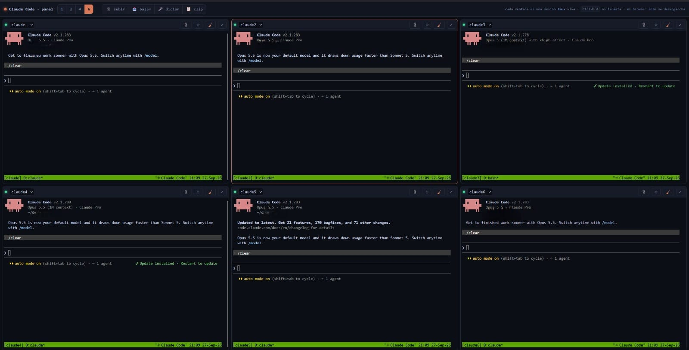

# Claude Code Control Room

**Run several Claude Code sessions in parallel from any browser, phone included, and see at a glance which one is working, which one is waiting for your permission, and who is touching what.**



Three layers, one idea: **several agents working on the same project without stepping on each other**.

| Layer | Answers | Lives in |
|---|---|---|
| **See** | what is each session doing right now, which one needs me? | the web grid + Claude Code hooks |
| **Coordinate** | who is touching what, right now? | `slog`: a live board with locks (ephemeral) |
| **Remember** | what did we learn, and why did we decide it? | skills in 3 layers + `skill-sync` (durable) |

What you get:

- **Live state per session**: working, idle, or **waiting for your permission**. It comes from Claude Code's own hook events, not from screen-scraping, so it doesn't break when the CLI's UI changes. A red badge in the top bar takes you straight to the session that needs you.
- **`slog`, a shared board with hierarchical advisory locks.** Every session can see what the others are doing and claim a resource (`api`) or just part of it (`api:auth`). Each tile shows the locks its session holds.
- **Built for the phone**: an on-screen key bar (Esc, arrows, Tab, Ctrl-C…), swipe to scroll history, tap-to-jump between sessions.
- **Files both ways**: upload, drag & drop, or **paste a screenshot with Ctrl-V**. The path gets typed into the session's prompt. The download dialog opens on an outbox where agents drop things for you.
- **📋 One-tap clip**: the agent leaves a long command with `cr-clip` and you copy it with one tap instead of fighting a terminal selection.
- **🎤 Dictation (optional)**: speech → Whisper → typed into the prompt *without* pressing Enter, with a hallucination filter based on Whisper's per-segment metrics.
- **Skills that survive the session**: a 3-layer structure (router / current state / decision log), a `skill-sync` skill that consolidates each session's findings before it closes, and `skill-lint` to catch what parallel sessions break (duplicate changelog ids, dead pointers, bloated routers).

No frameworks, no build step, no `npm install`: Python standard library, bash, and one HTML file.

> Community project, not affiliated with or endorsed by Anthropic. "Claude" and "Claude Code" are trademarks of Anthropic.

---

## ⚠️ Security: read this before anything else

**This project ships with NO authentication.** Whoever can open the page gets a shell running as your user, with whatever your Claude sessions can do.

### What was removed from the original setup, and what you must replace

The deployment this was extracted from ran behind several protections. They were **deliberately removed** from this release, because each one is specific to one infrastructure and publishing it would mean publishing that infrastructure. **You have to put your own equivalents back:**

| Removed layer | What it did | Pick your replacement |
|---|---|---|
| **Identity-aware proxy (SSO)** | Only one specific account could even load the page | Cloudflare Access / Tunnel, Tailscale, oauth2-proxy, Authelia, Pomerium… |
| **Origin IP allowlist** | The server only accepted connections coming from that proxy, so it couldn't be reached directly | Firewall rules, or bind to localhost / a private interface only |
| **Second factor (TOTP)** | A code from an authenticator app on top of the SSO login, with long sessions | Your proxy's MFA (most of the ones above have it) |
| **TLS** | Encrypted transport | Whatever proxy/tunnel you choose |

### What *is* still built in

- Binds to **`127.0.0.1` only** by default. The server prints a warning if you change that.
- **ttyd has no TCP port at all**: it listens on a UNIX socket and is reachable only through this server's `/tty/` proxy.
- Terminals can open **only the session names you allowlist** (`CR_SESSIONS`).
- The file browser only serves paths **inside `CR_FILE_ROOTS`**, resolved with `realpath` (`../` tricks and escaping symlinks get a 404).
- Delete works **only inside `uploads/` and `outbox/`**. It's never recursive and always goes through a POST (link prefetchers can't trigger it).
- Uploaded paths and dictated text are typed into the prompt **without Enter**, so nothing runs until you review it.

### The fastest safe way to use it remotely

```bash
# on your laptop/phone-with-a-terminal: tunnel the port over SSH, nothing gets exposed
ssh -L 7680:127.0.0.1:7680 you@your-server
# then open http://127.0.0.1:7680
```

For a phone without SSH, use a zero-trust proxy (Tailscale, Cloudflare Tunnel + Access…). **Never** port-forward it raw to the internet.

---

## Quick start

Tested on Ubuntu 24.04. Any recent Linux works; macOS is not supported (the scripts use GNU `date` and `flock`).

```bash
# 1. Install dependencies
sudo apt update
sudo apt install -y tmux python3 git
sudo apt install -y imagemagick poppler-utils     # optional: shrink uploaded images, extract PDF text

# 2. Install ttyd (version 1.7 or newer)
sudo apt install -y ttyd                          # Ubuntu 24.04+ / Debian 12+ ship 1.7.x
ttyd --version                                    # older distros ship 1.6.x: use the official binary instead ↓
# sudo curl -fsSL -o /usr/local/bin/ttyd https://github.com/tsl0922/ttyd/releases/download/1.7.7/ttyd.x86_64
# sudo chmod +x /usr/local/bin/ttyd               # (ttyd.aarch64 on ARM)

# 3. Install Claude Code, if you don't have it yet
#    https://docs.claude.com/en/docs/claude-code/setup

# 4. Clone
git clone https://github.com/Ramillax/claude-code-control-room.git
cd claude-code-control-room

# 5. Install (checks everything, writes the config, adds the hook, the skill and the tmux settings)
bash install.sh --all --workdir ~/your-project
echo 'export PATH="$PATH:'"$PWD"'/bin"' >> ~/.bashrc && source ~/.bashrc

# 6. Start
./start.sh                                        # → open http://127.0.0.1:7680
```

Then **tell the agents how to behave**: paste `examples/CLAUDE.md-snippet.md` into your project's `CLAUDE.md`. Locks and skill-sync are conventions: they work because the agents are told to follow them. Add `.controlroom/` to your project's `.gitignore`.

Ctrl-C stops the UI. **Your sessions keep running in tmux**: closing the browser or the UI only detaches. To reach it from another device, read the **Security** section first.

### What `install.sh` does

It never downloads anything and never needs sudo. Every step backs up what it edits and is safe to run again. Without `--all` it only checks dependencies and creates `controlroom.env`. The optional parts:

- `--hooks` adds the state hook to `~/.claude/settings.json` (keeps your existing settings). Without it the tiles still work, but their state dot stays grey. Restart running sessions after adding it.
- `--skills` installs the `skill-sync` skill into `~/.claude/skills/`.
- `--tmux` appends `examples/tmux.conf` to `~/.tmux.conf`: mouse/swipe scrolling, copying to the device clipboard, and it disables tmux's right-click menu, whose "Kill" item used to kill sessions on a stray tap.
- `--workdir` is the folder new sessions start in (your project).

Prefer to do it by hand? Every step has its source in `examples/`.

For always-on, see `examples/systemd/`, and **keep `KillMode=process`**. The tmux server is started by ttyd, so it lives in ttyd's cgroup; with the default kill mode, restarting the service kills every Claude session along with it.

---

## `slog`: coordination between parallel sessions

Each Claude Code window is blind to the others. `slog` gives them one plain Markdown file to read and append to. It costs one Bash call and is never auto-loaded into the model's context.

```bash
slog "migrating the users table"     # feed line
slog status                          # active locks + recent feed (run before touching shared stuff)
slog take "db:users"                 # lock only what you touch
slog take db                         # ⚠ warns: overlaps db:users held by claude2
slog free "db:users"                 # ✅ released: db:users (14m since 10:32)
slog done                            # end of session: removes YOUR lines, never other sessions'
```

- **Hierarchical**: `db:users` and `db:orders` don't conflict; `db` conflicts with both.
- **Race-free**: writers are serialized with `flock` (tested with 20 concurrent `take`s).
- **Traceable**: inside Claude Code every line ends with `s:<session id>`, which is the transcript's file name (`~/.claude/projects/<project>/<id>.jsonl`). A `take`/`free` pair therefore brackets the exact stretch of the exact conversation that held the lock. That link can't be reconstructed afterwards, so it's stamped at write time.
- **Aliases**: map long IDs to readable names in `slog-aliases` (`billing=wf_8f3kQ2`) and both spellings lock the same key.
- `slog locks` prints TSV, which is what the UI reads.

## Skills: knowledge that survives the session

The board is ephemeral on purpose. What a session *learned* (how a subsystem really works, why a decision was made, which trap it fell into) has to land somewhere durable before the session closes, or the next one starts cold and re-discovers it. With several sessions writing that knowledge in parallel, it rots fast unless there are rules. These rules come from real incidents:

- A reference said one version of a component while production ran another. Sessions trusted the doc and built on it, and the error cascaded. → **snapshot vs pointer**: never copy live values; write where they live and how to read them.
- Two sessions read the same highest changelog id and both used it. → `skill-lint` flags duplicate ids.
- Dozens of cross-references broke after files were renamed. → `skill-lint` flags pointers to missing files.
- A session "cleaned up" the shared board and deleted another session's live lock. → `slog done` only ever removes your own lines.

**The structure** (create one with `skill-new <name>`):

```
.claude/skills/my-subsystem/
├── SKILL.md                  router: when to use it + map of references (keep < 12 KB, loaded in full every time)
└── references/
    ├── overview.md           how it works TODAY (one truth, one place)
    └── changelog.md          decision log: **#NNN** · what changed, when and WHY
```

Git already records *which bytes* changed. The changelog records what git can't: the reasoning, and changes made outside the repo (databases, APIs, deployed services). Its `#NNN` ids are stable, so other files can say "see #42" instead of repeating the story.

**The workflow**: at the end of a session, say *"sync skills"*. The `skill-sync` skill makes the agent inventory **its own** work (never another session's: a feed line carries no reasoning), verify every fact against the live system, route each fact to its single owner file (`references/owners-map.md`), log decisions, then close the board with `slog done`.

```bash
skill-new payments-api            # scaffold ./.claude/skills/payments-api
skill-new payments-api --personal # …or in ~/.claude/skills (all your projects)
skill-lint                        # check ./.claude/skills and ~/.claude/skills
```

Claude Code's built-in memory is the complement: skills hold **how the system works**; memory holds **your preferences and project state**.

## Dictation (optional, off by default)

The 🎤 button only appears once you configure **your own** Whisper endpoint. Nothing is bundled, and no key or endpoint ships with this repo.

**Azure OpenAI**
1. Create an Azure OpenAI resource and **deploy a `whisper` model** in it.
2. In `controlroom.env`:
   ```bash
   CR_STT_PROVIDER=azure
   AZURE_OPENAI_ENDPOINT=https://YOUR-RESOURCE.openai.azure.com
   AZURE_OPENAI_API_KEY=your-key
   AZURE_WHISPER_DEPLOYMENT=whisper        # the deployment name you chose
   ```

**OpenAI**
```bash
CR_STT_PROVIDER=openai
OPENAI_API_KEY=sk-...
CR_STT_MODEL=whisper-1      # the model that returns per-segment metrics (needed by the filter)
```

Optional: `CR_STT_LANGUAGE=en` and `CR_STT_PROMPT="Postgres, Kubernetes, YourProduct"`. Put **only proper nouns** in the prompt and keep it short. It gets fed to the decoder as context, not as an instruction: in testing, a 269-character prompt that opened with explanatory prose made *real* words come out wrong, while ≤113 characters of plain names did not.

**Privacy:** your audio is sent to the provider you configure. The last 12 dictations (audio + metrics + text) are kept locally in `.controlroom/dictations/`, so that a "it misheard me" can actually be investigated. Delete that folder if you'd rather not keep them.

**Why the filter matters:** on silence or background noise, Whisper doesn't return nothing. It returns fluent, plausible text ("Thanks for watching!", "Subtitles by the Amara.org community"). You can't catch a *new* hallucination by looking at the string, but you can by looking at the metrics. Thresholds measured on real traffic:

| input | `no_speech_prob` |
|---|---|
| real speech | 0.00 – 0.18 |
| 3 s of silence / noise / a pure tone | 0.75 – 0.95 |

`avg_logprob` does **not** separate the two (the hallucination is confident, well-formed text). It and `compression_ratio` catch the other two failure modes: mumbling and repetition loops. Filtering happens per segment, so a good dictation with a noisy tail still survives.

## On the phone

- The key bar sends keys to the **active** tile (the most visible one). `clr` = Ctrl-U (clears Claude's prompt). **`^Z` suspends to the shell, it is not undo**; `fg` brings Claude back. Destructive keys need a double tap.
- **Copying from a terminal**: scroll up one notch (enters tmux copy-mode and freezes the screen), then drag and release. The selection goes to your device clipboard via OSC 52. Or have the agent use `cr-clip`.
- If the 🎤 fails with `NotAllowedError` while the site permission is granted, the block is at the OS level, or it's a `Permissions-Policy` header from your proxy, which must allow `microphone=(self)`.

## What's in the box

```
install.sh                 one-step setup (idempotent, backs up what it edits)
start.sh                   runs ttyd + the server in the foreground
controlroom.env.example    every setting, commented
bin/
  slog                     live board + hierarchical advisory locks
  cr-session               what each terminal tile runs (session allowlist, tmux attach-or-create)
  cr-clip / cr-expose      hand text / files to the human
  skill-new / skill-lint   scaffold and check skills
server/server.py           UI, /tty proxy, status API, files, dictation (Python stdlib only)
web/index.html             the grid (one file, no build)
hooks/cr-state-hook.py     Claude Code hook → per-session state
skills/                    skill-sync + the 3-layer template
examples/                  CLAUDE.md snippet, hooks JSON, tmux.conf, systemd units
```

## How it fits together

```
 browser ──► your auth proxy ──► server.py (127.0.0.1:7680)
                                   ├─ /            grid UI (web/index.html)
                                   ├─ /tty/*  ───► ttyd (UNIX socket) ──► cr-session ──► tmux ──► claude
                                   ├─ /api/status ◄─ state/<session>.json ◄── cr-state-hook.py (Claude Code hooks)
                                   │               ◄─ slog locks + feed   ◄── SESSIONS.md ◄── slog (from any session)
                                   ├─ /upload /files /dl /rm   (.controlroom/uploads, outbox)
                                   ├─ /clip.txt   ◄── cr-clip
                                   └─ /stt ──► Whisper (optional) ──► tmux send-keys (no Enter)
```

Everything is served from **one origin**. That's what lets the page reach into the terminal iframes (the key bar, touch scrolling, the clipboard bridge).

Uploads and dictation use a normal `<form>` POST into an iframe, never `fetch()`. Some auth proxies answer background requests with an interactive challenge page, which silently breaks them, while a form submission is a navigation and goes through. Keep that pattern if you extend it.

## Configuration

All settings live in `controlroom.env` (see `controlroom.env.example`, where every option is commented). The main ones:

| Variable | Default | |
|---|---|---|
| `CR_SESSIONS` | `claude1 claude2 claude3 claude4 shell` | allowlist of tmux sessions (one tile each) |
| `CR_WORKDIR` | `$HOME` | where new sessions start |
| `CR_CLAUDE_CMD` | `claude --resume` | what a Claude tile runs on creation |
| `CR_TMUX_SOCKET` | *(default server)* | use a dedicated tmux server |
| `CR_BIND` / `CR_PORT` | `127.0.0.1` / `7680` | keep it on localhost |
| `CR_FILE_ROOTS` | workdir + `.controlroom` | what the download dialog may browse |
| `CR_STT_PROVIDER` | *(off)* | `azure` or `openai` |

## Known limitations

- Linux only. This release was tested with tmux 3.4, ttyd 1.7.4 and Python 3.12. The UI comes from a panel used daily on desktop Chrome and Android browsers; iOS Safari is untested.
- Single user by design: whoever passes your auth proxy is you.
- Locks are advisory. They coordinate cooperative agents; they don't enforce anything.
- The state dot reflects the last hook event. A session that was killed abruptly can show a stale state until its tmux session is gone (then it shows "off").

## Contributing

Issues and pull requests are welcome: see [CONTRIBUTING.md](CONTRIBUTING.md) (the project's ground rules and how to test in isolation). Security problems go through private reporting: see [SECURITY.md](SECURITY.md).

## Credit

If you use this, fork it, or build on it, **please credit the author**: a link back to this repository in your README or docs is enough. The MIT license also requires keeping the copyright notice in copies. GitHub's "Cite this repository" button (from `CITATION.cff`) gives you a ready-made citation.

## License

MIT, see [LICENSE](LICENSE).
